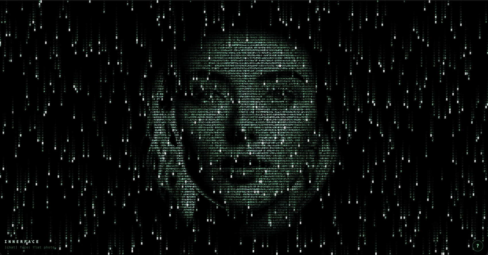

# innerFace

> A face for an LLM, emerging from the matrix rain.

innerFace is a voice + visual interface where an LLM's face coalesces out of
falling green code and speaks to you, face to face. Drag-and-drop a photo and
it becomes the face she wears; she remembers it across reloads. Ask her
something out loud and she replies — her mouth, eyes, and expression animate
to the words.

It's a single-page WebGL app. No build step, no framework, no backend
required for the core experience — just a static server and an Anthropic API
key you enter in the browser.

<!-- Hero image — replace the placeholder below with a real screenshot.
     See "Adding screenshots" at the bottom of this file. -->
<p align="center">
  
</p>


---

## What it does

- **Matrix-rain face.** The face isn't drawn on top of the rain — it *is* the
  rain, modulated. Glyphs cling to an invisible 3D surface and glow with the
  surface lighting; falling code brightens as it passes over the face.
- **Two face modes.**
  - **Procedural** (default on first load) — an analytic 3D face built in the
    shader, with eyes, brows, nose, and a mouth that cycles visemes.
  - **Photo** — drop or paste an image. It's processed into a luminance +
    depth field, facial landmarks drive mouth/blink animation, and a 3D mesh
    can be toggled on for real head turns.
- **She remembers.** The last photo you drop is stored in IndexedDB and
  restored on the next load — she greets you wearing the face she last wore.
- **Voice loop.** Talk to her out loud (browser SpeechRecognition), she thinks
  (streaming Anthropic API), and speaks back (browser SpeechSynthesis, or
  ElevenLabs for natural voices with timestamped lip sync).
- **Coding-agent brain (optional).** Flip her brain to "agent" and she'll run
  a local coding agent (`claude -p`) through a tiny relay server, then
  summarize what she did out loud.

## Quick start

You need a static server because the app uses ES modules (`import`), which
browsers refuse to load over `file://`.

```bash
# any static server works; two options:

# 1) Python (no install on most systems)
python3 server.py
#   → http://localhost:8137   (also enables the optional agent brain)

# 2) or, the simplest possible static server
python3 -m http.server 8000
#   → http://localhost:8000   (core app only; /api/agent won't be available)
```

Open the URL, press **`K`**, and paste an Anthropic API key. Then press **`V`**
and talk to her.

> **Heads-up on first load after the rename:** if you used an earlier
> `ModelFace` build, your saved face and keys lived under `modelface_*`
> storage keys. They're now `innerface_*`, so you'll re-drop your image and
> re-enter keys once. After that she remembers again.

### Keys (all browser-local, never sent anywhere except the vendor)

| Key | Where it's used | Required? |
|---|---|---|
| Anthropic API key | `js/llm.js` — streaming chat | For chat / voice |
| ElevenLabs API key | `js/eleven.js` — natural TTS + visemes | Optional (falls back to browser TTS) |

Keys live in `localStorage`. There is no server that handles them — the
browser calls the APIs directly.

## Controls

| Key | Action |
|---|---|
| `V` | Talk to her (voice in / voice out) |
| `Enter` | Type instead of speaking |
| `A` | Brain: chat ↔ coding agent |
| `K` | Enter API keys |
| `Space` | Face on / off (watch it dissolve back into rain) |
| `M` | Your mic drives the glow |
| `T` | Auto-talk demo (she babbles — useful with no API key) |
| `E` | Cycle expression |
| `P` | Photo ↔ procedural face |
| `G` | Toggle 3D mesh (experimental; see below) |
| `F` | Fullscreen |
| `?` | In-app help |
| *drag/paste* | Drop or paste an image to use your own face |

## Browser support

- **Chrome / Edge** — fully supported (SpeechRecognition is Chromium-only).
- **Safari** — works; SpeechRecognition supported, voices differ.
- **Firefox** — the visual + chat works, but no in-browser speech recognition
  (use `Enter` to type). TTS works.

WebGL is required.

## The two face renderers (and the experimental mesh)

innerFace has two independent rendering paths, isolated as separate branches
in the shader:

1. **Flat photo (default).** The dropped image rendered through glyphs, with
   parallax, jaw-warp, and blink for motion. Clear, reliable, works on most
   images. **This is the path to judge the project by.**
2. **3D mesh (`G`, experimental).** A real rotating 3D face built from the 468
   MediaPipe landmarks, composited over the photo. It's expressive — real head
   turns, real jaw hinge — but MediaPipe's depth is a *learned guess*, not a
   scan, so on many photos it reads as a hollow "masquerade mask" rather than
   a face. It's opt-in per image. Treat it as a research toggle, not the
   default experience. See [the mesh notes](#the-3d-mesh-experimental) below.

The flat path is untouched by anything that happens to the mesh.

## Project layout

```
index.html          shell + HUD
styles.css          fullscreen canvas, terminal-style HUD
server.py           optional dev server (static + /api/agent relay)
js/
  main.js           state machine, demo timeline, controls, main loop
  renderer.js       WebGL: shaders, textures, full-screen quad
  shaders.js        GLSL: rain + procedural face + photo + mesh
  glyphs.js         katakana/latin glyph atlas generator
  face.js           parametric face: expressions, visemes, blink, morphing
  photo.js          image → luminance/depth/mask + MediaPipe landmarks
  mesh.js           468 landmarks → 3D mesh + normals (the experimental path)
  audio.js          mic level meter + synthetic fallback
  speech.js         browser STT (SpeechRecognition) + TTS (speechSynthesis)
  llm.js            Anthropic streaming client
  eleven.js         ElevenLabs TTS with timestamped visemes
```

## <a name="the-3d-mesh-experimental"></a>The 3D mesh (experimental)

The mesh path exists and is reachable via `G`, but it has known ceiling
problems that more tuning won't fix:

- **MediaPipe z-depth is a learned estimate**, not a real scan. On clean
  frontal photos it's passable; on 3/4 or partial faces the 3D shape is wrong.
- **A 468-point mesh produces faceted, noisy normals** under diffuse lighting.
- **Composited over a static photo backdrop**, so head turns ghost along the
  coverage edge.

We've iterated on it (stabilized depth via a face-shaped prior, Laplacian
normal smoothing, backdrop removal) and it improved — but the fundamental
ceiling is that *lit coarse geometry can't be a readable face without becoming
the photo*. The flat path is the reliable experience; the mesh is a sandbox
for future work. Ideas welcome — see [Contributing](CONTRIBUTING.md).

## Optional: the coding-agent brain

`server.py` does two jobs: serve the static app with caching disabled, and
relay `POST /api/agent` to a local `claude -p` CLI. If you want the "agent"
brain (toggle with `A`):

1. Install the [Claude CLI](https://docs.anthropic.com/en/docs/claude-code)
   and ensure `claude` is on your `PATH`.
2. Run `python3 server.py` (not the bare `http.server` — only `server.py`
   implements `/api/agent`).
3. Optionally set `AGENT_CWD` to the directory you want the agent to work in.

The agent keeps its own conversation memory via `--continue`. The relay is
bound to `127.0.0.1` only — it never listens on a public interface.

## Privacy

- **No backend of ours.** The browser talks to Anthropic / ElevenLabs
  directly. `server.py` is a dev convenience + optional agent relay, bound to
  localhost.
- **Keys stay in your browser** (`localStorage`). They're sent only to the
  vendor whose key it is.
- **Photos never leave your browser.** Image processing (landmarks, depth,
  luminance) is all client-side; the processed field is stored in IndexedDB
  locally.
- **Microphone** is opt-in (`M` or `V`) and processed locally for the glow
  effect / speech recognition.

## Contributing

PRs and issues welcome — especially around the 3D mesh (it needs real work)
and the procedural face's character. See [CONTRIBUTING.md](CONTRIBUTING.md)
and the [help-wanted](https://github.com/kurokaita/innerface/labels/help%20wanted)
label. By contributing you agree to abide by the
[Code of Conduct](CODE_OF_CONDUCT.md).

## License

[MIT](LICENSE) © kurokaita

---

## Adding screenshots & GIFs

The hero image at the top of this README lives at `docs/hero.png`. To add it
(or any image), you have two options.

### Option A — commit the image to the repo (recommended for the hero)

1. Capture a screenshot. For the full app window on macOS:
   `Cmd+Shift+4`, then `Space`, then click the window. Save as `docs/hero.png`.
2. For an animated GIF (better conveys the rain + talking), record a short
   screen recording then convert it:

   ```bash
   # record.mov → docs/hero.gif  (15fps, 600px wide, optimized)
   ffmpeg -i record.mov -vf "fps=15,scale=600:-1:flags=lanczos" \
     -loop 0 docs/hero.gif
   ```

3. If you used a GIF, update the `` line above to
   `docs/hero.gif`.
4. Commit and push — GitHub renders images from the repo in the README.

### Option B — paste into the GitHub issue/PR UI

Open any issue, drag an image into the comment box, and GitHub returns a URL
like `https://github.com/user-attachments/assets/...`. Paste that URL into the
README. The image is hosted by GitHub but not tracked in the repo. Faster, but
less portable (the link is tied to that upload).

### A note on the test face

If you screenshot a real person's face that you dropped into the app, make
sure you have the right to publish it. A stock photo, a CC0 portrait, an AI-
generated face, or your own face are all safe. The face in `docs/hero.png`
should be something you're comfortable being the public face of the project.
